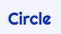
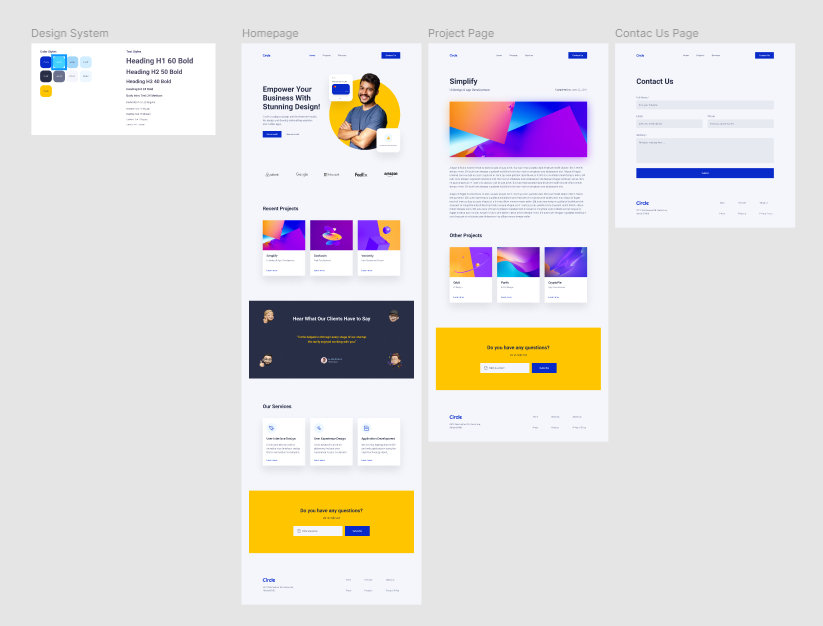

# CIRCLE AGENCY

## Introducción

Este lab, es el proyecto final de la primera unidad formativa de este bootcamp de IronHack, en el tenemos que clonar esta pagina web:
https://midterm-circle-ironhack.netlify.app/

Creando desde 0 todo el html, css y javascript, podiamos acceder a la pagina web para ver como estaba montada y tambien teniamos a nuestra disposición en figma organizativo de todas las paginas que tiene la web, con todo el contenido de cada una de ellas.

Para realizar la pagina web teniamos que poner en practica todo lo aprendido hasta ahora en el bootcamp utilizando los conocimientos de HTML y CSS. También tendrás que crear algunas interacciones con el DOM, utilizando lo aprendido sobre JavaScript hasta ahora.

